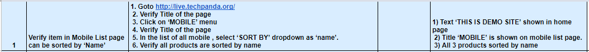
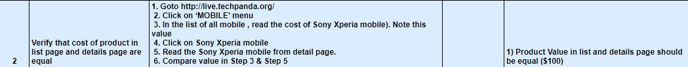
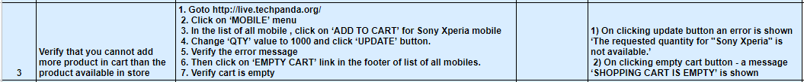
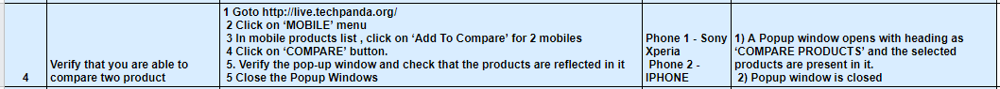
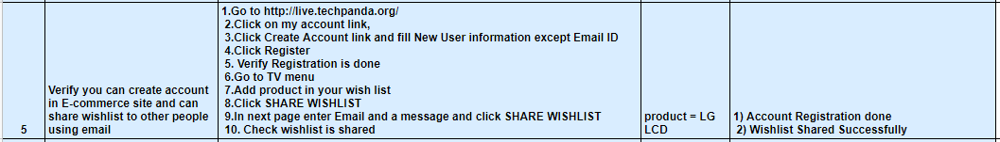
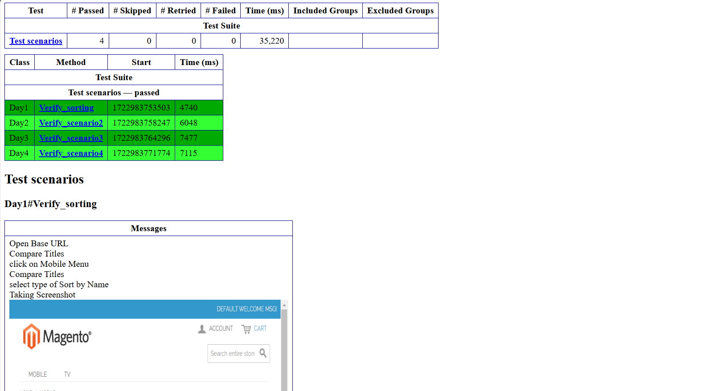

 
	

# Ecommerce website Testing Project
- Testing Ecommerce Website using Selenium and TestNG with Java
- Github Actions
### AUT
http://live.techpanda.org/

## Day1
The following test case needs to be automated

## Day2
The following test case needs to be automated

## Day3
The following test case needs to be automated

## Day4
The following test case needs to be automated

## Day5
The following test case needs to be automated

## Sample Result for Every CI Run

